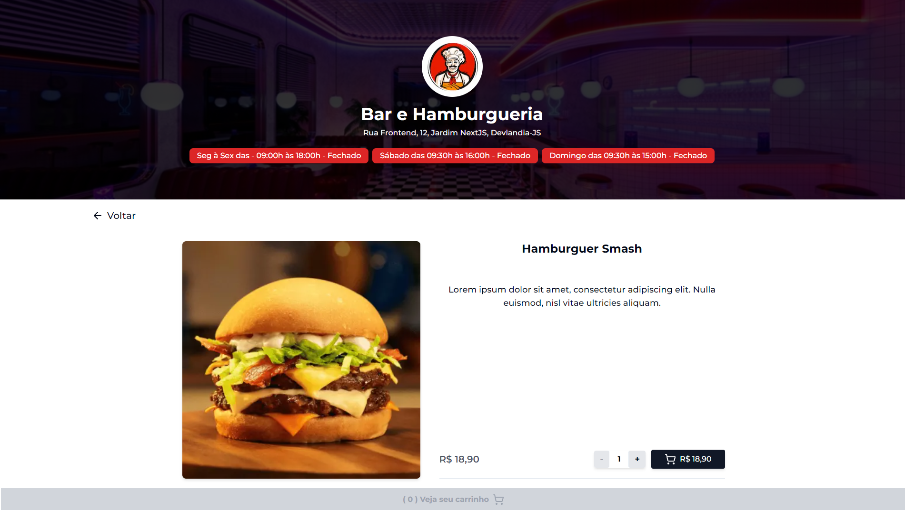
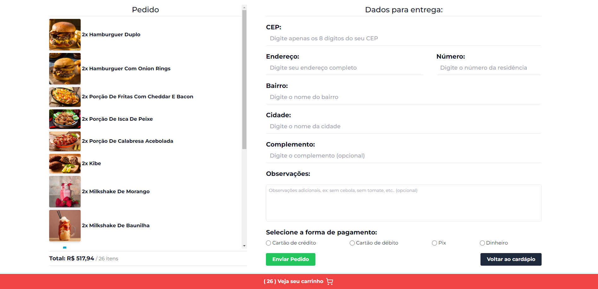

# 🍔 Cardápio - Bar e Hamburgueria

## Sobre o Projeto 💻

O Cardápio do "Bar e Hamburgueria" é uma aplicação que permite aos clientes visualizar o menu, adicionar itens ao carrinho e enviar um pedido diretamente para o WhatsApp da loja. Além disso, os clientes podem especificar se desejam retirar no balcão ou solicitar entrega, fornecendo informações de endereço e forma de pagamento, se necessário.

**Nota: Este projeto foi originalmente desenvolvido como um projeto local de estudo e portanto não possui histórico de commits disponível.**

## Funcionalidades Principais 📝

### ⏰ Horários de Abertura e Fechamento em Tempo Real

Os horários de abertura e fechamento do restaurante são exibidos em tempo real, utilizando a API da WorldTime. Essas informações são atualizadas automaticamente sempre que o restaurante abre ou fecha, graças ao uso de um contexto.

### 📬 Preenchimento Automático do Endereço

Ao preencher o endereço para entrega, a aplicação utiliza a API ViaCEP para buscar o CEP do usuário e preencher automaticamente os outros dados do endereço.

### 📱 Interface Responsiva

A interface é totalmente responsiva, adaptando-se ao dispositivo do usuário. O menu com as seções e o campo de busca mudam dinamicamente de acordo com o dispositivo, proporcionando uma experiência consistente e intuitiva.

## Tecnologias Utilizadas 🚀

- [React](https://react.dev/): Biblioteca JavaScript para construção de interfaces de usuário.
- [Next.js](https://nextjs.org/): Framework React para construção de aplicações web que oferece renderização do lado do servidor (SSR), geração estática (SSG), entre muitos outros recursos.
- [TypeScript](https://www.typescriptlang.org/): Linguagem de programação.
- [Tailwind CSS](https://tailwindcss.com/): Framework CSS para estilização que oferece várias classes para utilização já pré-estilizadas.
- [React Hook Form](https://react-hook-form.com/): Biblioteca para gerenciamento de formulários em aplicações React.
- [Zod](https://github.com/colinhacks/zod): Biblioteca de validação de esquemas para TypeScript e JavaScript.
- [Lucide React Icons](https://lucide.dev/): Biblioteca de ícones para React.
- [React Toastify](https://www.npmjs.com/package/react-toastify): Componente para exibição de notificações.
- [Shadcn](https://ui.shadcn.com/): Biblioteca UI de componentes reutilizáveis.

## Instalação ⚙️

Para instalar o projeto localmente, siga os passos abaixo:

1. Clone este repositório.
2. Instale as dependências utilizando `npm install`.
3. Execute o aplicativo utilizando `npm run dev`.

## Imagens Relevantes 🖼️

### Página Inicial (Desktop)

Esta é a página inicial da aplicação em um ambiente de desktop.

### Página Inicial (Mobile)

Página inicial da aplicação em um dispositivo móvel, destacando o menu que se adapta de acordo com a seção explorada pelo usuário.

### Detalhes do Produto

Página de detalhes do produto, onde os clientes podem ver mais informações sobre um item específico do menu.

### Página de Entrega

Página onde os clientes preenchem os dados para entrega, incluindo endereço e forma de pagamento.

